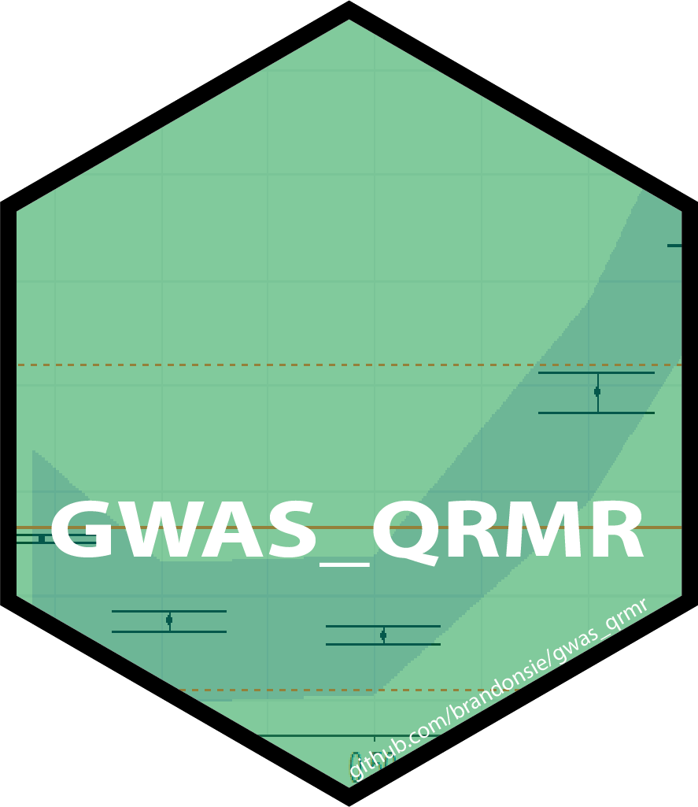

# GWAS_QRMR 

GWAS_QRMR provides an R plugin for [plink 1.9](https://www.cog-genomics.org/plink2/) to perform genome-wide [quantile regression](https://en.wikipedia.org/wiki/Quantile_regression) with quantitative trait data and a workflow for subsequent [meta-regression](https://en.wikipedia.org/wiki/Meta-regression). In contrast to normal mean linear regression, quantile regression can represent information about variants that exhibit non-homogenous effect sizes across different subsets of a population, a hallmark of [GxG](https://en.wikipedia.org/wiki/Epistasis) and [GxE](https://en.wikipedia.org/wiki/Gene%E2%80%93environment_interaction) interactions. In contrast to other interaction study approaches, QRMR requires no knowledge about the identity of the interacting feature. 

For more information, check out this [slide deck](slides/QR_slides.html).

## Setup
### Required/Suggested Software
- quantile regression w/ R plugin [plink 1.9 2020-06-17+](https://www.cog-genomics.org/plink2/)
- [R](https://www.r-project.org/) (version 3.6.3+)
  - R packages [quantreg 5.6.7+](https://CRAN.R-project.org/package=quantreg), [Rserve 1.8+](https://www.rforge.net/Rserve/) [metafor 2.4+](https://CRAN.R-project.org/package=metafor) [magrittr](ttps://CRAN.R-project.org/package=magrittr)
  - (suggested R packages) for visualization [ggplot2](https://CRAN.R-project.org/package=ggplot2), [plotly](https://CRAN.R-project.org/package=plotly)
- (suggested) for faster mean linear regression [plink 2.0](https://www.cog-genomics.org/plink/2.0/)

### Input Data
- standard plink1 genotype data input: .bed, .bim, .fam files. [plink1.9 .bed documentation](https://www.cog-genomics.org/plink/1.9/input#bed) 
- quantitative phenotype information (.phe) and covariate information (.cov)

### Execution
- call `plink --R $path_to_function` with additional desired parameters. An example .sh + slurm sbatch configuration used on Harvard's [O2 cluster](https://wiki.rc.hms.harvard.edu/display/O2/O2) is provided in `gwas_qrmr/scripts/`
  - plink + this r plugin will produce an output of 45 metrics from quantile regression for each snp. example downstream meta-regression based on this output is provided in `gwas_qrmr/metaregression/`

## Shiny App

## References