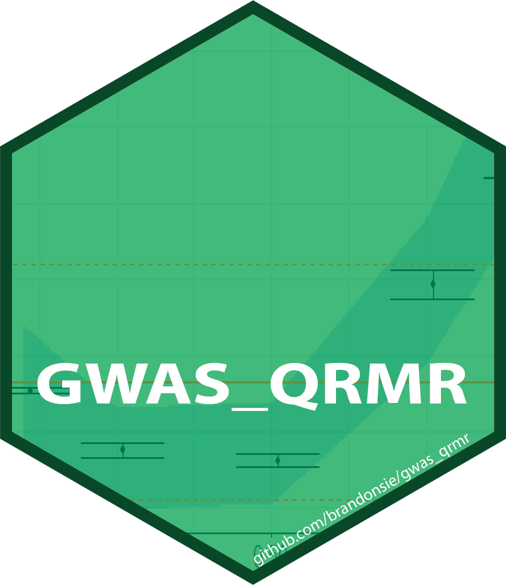

# GWAS_QRMR 

GWAS_QRMR provides an R plugin for [plink 1.9](https://www.cog-genomics.org/plink2/) to perform genome-wide [quantile regression](https://en.wikipedia.org/wiki/Quantile_regression) with quantitative trait data and a workflow for subsequent [meta-regression](https://en.wikipedia.org/wiki/Meta-regression). In contrast to normal mean linear regression, quantile regression can represent information about variants that exhibit non-homogenous effect sizes across different subsets of a population, a hallmark of [GxG](https://en.wikipedia.org/wiki/Epistasis) and [GxE](https://en.wikipedia.org/wiki/Gene%E2%80%93environment_interaction) interactions. In contrast to other interaction study approaches, QRMR requires no knowledge about the identity of the interacting feature. 

For more information, check out this [slide deck](https://brandonsie.github.io/pages/QR_slides.html).

## Methods Overview
- run quantile regression using plink + R-plugin. for specified quantiles, identify estimated effect size and standard error.
- perform meta-regression to test for association between effect size and quantile.
- (optional, for comparison) run linear regression on same variants for comparison. identify estimated effect size and standard error.

## Setup
### Required/Suggested Software
- quantile regression w/ R plugin [plink 1.9 2020-06-17+](https://www.cog-genomics.org/plink2/)
- [R](https://www.r-project.org/) (version 3.6.3+)
  - R packages [quantreg 5.6.7+](https://CRAN.R-project.org/package=quantreg), [Rserve 1.8+](https://www.rforge.net/Rserve/) [metafor 2.4+](https://CRAN.R-project.org/package=metafor) [magrittr](ttps://CRAN.R-project.org/package=magrittr)
  - (suggested R packages) for visualization [ggplot2](https://CRAN.R-project.org/package=ggplot2), [plotly](https://CRAN.R-project.org/package=plotly)
- (suggested) for faster mean linear regression [plink 2.0](https://www.cog-genomics.org/plink/2.0/)

### Input Data
- standard plink1 genotype data input: .bed, .bim, .fam files. [plink1.9 .bed documentation](https://www.cog-genomics.org/plink/1.9/input#bed) 
- quantitative phenotype information (.phe) and covariate information (.cov)

### Execution
- call `plink --R $path_to_function` with additional desired parameters. An example .sh + slurm sbatch configuration used on Harvard's [O2 cluster](https://wiki.rc.hms.harvard.edu/display/O2/O2) is provided in `gwas_qrmr/scripts/`
  - plink + this r plugin will produce an output of 45 metrics from quantile regression for each snp. example downstream meta-regression based on this output is provided in `gwas_qrmr/metaregression/qrmr_example.Rmd` along with some fictional quantile regression data as input.
  - real output summary statistic of uk biobank qrmr, filtered to variants with significant meta-regression p-value (b1 or b2) for bmi, height, and HbA1c provided in `gwas_qrmr/metaregression/qrmr_filtered_output/`.

## Shiny App

An example of significant non-homogenous effect sizes for BMI, height, and HbA1c is available at this [shiny app](https://brandonsie.shinyapps.io/QRMR_browser/)

## Brandon's Thoughts
Quantile regression, in the context of genetic association analysis, is an interesting way to potentially uncover variants with non-homogenous effect size that may have been missed by standard association methods. These quantile-dependent effects may occur for a variety of reasons, including GxG and GxE interactions.  

The main obstacle for this method is that the estimation of quantile regression standard error is quite slow compared to other association methods. The quantile regression output reported in this repository and in the associated shiny app were produced using 12 covariates (sex, age, 10 PC's from UK Biobank). Ideally, we would include more covariates. However, standard error computation becomes much much slower as the covariate dimension is increased. This is an area of ongoing research and I'm hopeful that improvements are on the horizon. However, using an R-plugin to perform quantile regression may introduce some unavoidable slowness that will be hard to avoid without rethinking the software used to perform this analysis.

Some former studies have performed quantile regression on GWAS data, subsetting initially to variants known previously to have genome-wide significance. While this dramatically cuts down the hypotheses tested and thus also dramatically reduces computation time, I feel this would dramatically reduce the potential of quantile regression for new discovery. From the three phenotypes tested here (height, BMI, HbA1c), the bulk of significant quantile-dependent associations are not detected by mean linear regression. 

## References
- Pozarickij, A., Williams, C., Hysi, P.G. et al. Quantile regression analysis reveals widespread evidence for gene-environment or gene-gene interactions in myopia development. Commun Biol 2, 167 (2019). https://doi.org/10.1038/s42003-019-0387-5 
- Song X, Li G, Zhou Z, Wang X, Ionita-Laza I, Wei Y. QRank: a novel quantile regression tool for eQTL discovery. Bioinformatics. 2017;33(14):2123-2130. doi:10.1093/bioinformatics/btx119
- Wei Y, Pere A, Koenker R, He X. Quantile regression methods for reference growth charts. Stat Med. 2006;25(8):1369-1382. doi:10.1002/sim.2271
- Fang Y, Xu P, Yang J, Qin Y. A quantile regression forest based method to predict drug response and assess prediction reliability. PLoS One. 2018;13(10):e0205155. Published 2018 Oct 5. doi:10.1371/journal.pone.0205155

## Resources
- [github/gwas_qrmr](https://github.com/brandonsie/gwas_qrmr)
- [qrmr shiny app](https://brandonsie.shinyapps.io/QRMR_browser/)
- [plink 2.0 alpha](https://www.cog-genomics.org/plink/2.0/)
- [plink 1.9 beta](https://www.cog-genomics.org/plink2/)
- [Rserve 1.8](https://www.rforge.net/Rserve/)
- [quantreg 5.67](https://cran.r-project.org/package=quantreg)
- [metafor 2.4-0](https://cran.r-project.org/package=metafor)

## Acknowledgements
- [Rag Group](https://www.chiragjpgroup.org/)
  - Chirag Patel  
  - everyone!
- NIH 5T32HG002295-18  
